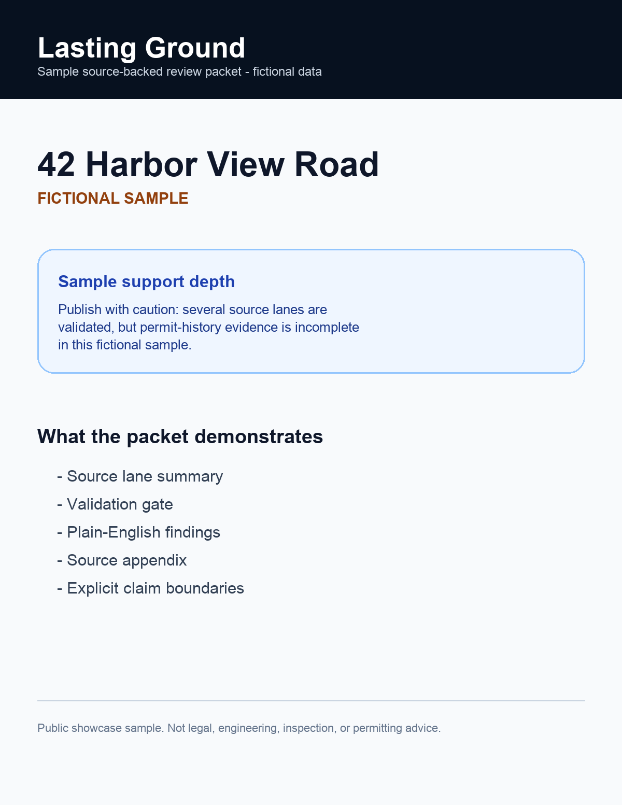
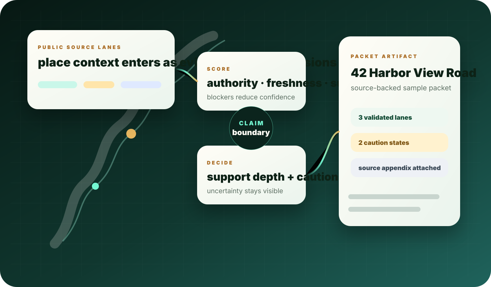
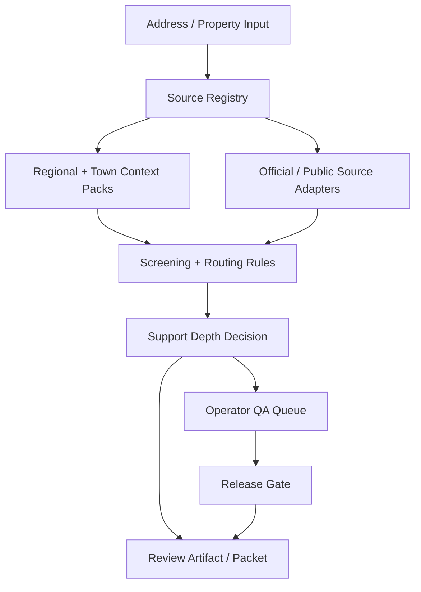

<div align="center">

# Lasting Ground

### Source-backed property review system for Massachusetts

A full-stack, evidence-first system that turns fragmented public-source property context into a four-page, source-dated review packet — one address at a time.

[**lastingground.com**](https://lastingground.com) &nbsp;·&nbsp; [**Live demo**](https://sulmusic2-star.github.io/lasting-ground-showcase/) &nbsp;·&nbsp; [**Sample packet**](https://sulmusic2-star.github.io/lasting-ground-showcase/assets/lasting-ground-sample-packet.pdf)

[](https://github.com/sulmusic2-star/lasting-ground-showcase/actions)
[](https://github.com/sulmusic2-star/lasting-ground-showcase/actions)
[](https://github.com/sulmusic2-star/lasting-ground-showcase)
[](LICENSE)
[](https://lastingground.com)

</div>

---



> **One address. One source-dated property check.** &mdash; The product translates federal flood maps, state coastal models, MassGIS layers, and town public records into a four-page packet a homeowner, buyer, attorney, or town agent can read in a sitting.

---

## The rule the system is built around

> If a source does not support a claim, the product does not pretend certainty.

Lasting Ground separates four states explicitly:

1. **Source-backed local detail** &mdash; this town published this layer, this date, this value
2. **Regional default** &mdash; the state model says X for this region, no town-specific override
3. **Missing evidence** &mdash; named gap, named so the reader knows what's not there
4. **Out of scope** &mdash; the kind of question a survey, attorney, engineer, or permit office answers, not the report

Most demos stop at the UI. Lasting Ground required the operating layer underneath.

---

## How it works



1. **Type a Massachusetts property address.** &nbsp;Address autocomplete checks coverage before checkout.
2. **See the free snapshot.** &nbsp;The snapshot shows source-depth, available core checks, and a few high-value signals.
3. **Get the full packet.** &nbsp;Four pages plus a sources-and-confidence appendix, by email, source-dated.

---

## What this build demonstrates

- **Full-stack product architecture** &mdash; address resolution, source registry, regional/town packs, validation gates, packet generation, operator QA queue, release gate
- **Evidence-first source registry design** &mdash; eight federal + state source families plus town-specific public records
- **Rules for support depth and claim strength** &mdash; deterministic gates decide what can be said before any generated explanation appears
- **Region/town pack architecture** &mdash; coastal towns, island towns, inland cities, dense urban have different surface profiles; the architecture treats local context as a product feature
- **Generated artifact workflows** &mdash; PDF packets with source-dated provenance, sample artifacts in the repo
- **Editorial-grade frontend** &mdash; vanilla HTML/CSS/JS with Fraunces variable serif, Geist sans, DM Serif Display; fluid responsive system with separate desktop and phone-tuned breakpoints
- **CI + coverage + decision records** &mdash; 18 passing tests, 93.29% line coverage, public ADRs, evaluator guide

---

## Architecture



**Source families used** &mdash; FEMA NFHL, MassGIS, MC-FRM, NOAA, USGS, MassDEP, NHESP, MACRIS, plus town public records where available.

---

## Reviewer path

Evaluating this quickly? Start here, in order:

1. **[Live site](https://lastingground.com)** &mdash; the production product
2. **[Live demo](https://sulmusic2-star.github.io/lasting-ground-showcase/)** &mdash; this repo, deployed
3. **[Sample PDF packet](https://sulmusic2-star.github.io/lasting-ground-showcase/assets/lasting-ground-sample-packet.pdf)** &mdash; the actual deliverable
4. **[Case study](docs/case-study.md)** &mdash; the product reasoning
5. **[Evaluator guide](docs/evaluator-guide.md)** &mdash; what to read in what order
6. **[Architecture decision records](docs/adr/README.md)** &mdash; the why behind the how
7. **Advanced logic** &mdash; [`evidence_scoring.py`](examples/evidence_scoring.py), [`packet_composer.py`](examples/packet_composer.py), [`source_lane_validation.py`](examples/source_lane_validation.py)
8. **[CI workflow](.github/workflows)** &nbsp;·&nbsp; **[Coverage summary](docs/coverage-summary.md)**

---

## Code examples

Small examples show how a sample source-lane input becomes a validation output before packet generation:

- [`examples/sample_packet_input.json`](examples/sample_packet_input.json) &mdash; raw input
- [`examples/source_lane_validation.py`](examples/source_lane_validation.py) &mdash; lane validation
- [`examples/sample_validation_output.json`](examples/sample_validation_output.json) &mdash; what comes out
- [`examples/evidence_scoring.py`](examples/evidence_scoring.py) &mdash; scoring rules
- [`examples/packet_language.py`](examples/packet_language.py) &mdash; cautious language patterns
- [`examples/packet_composer.py`](examples/packet_composer.py) &mdash; packet assembly
- [`examples/sample_packet_summary.txt`](examples/sample_packet_summary.txt) &mdash; sample output

### Run the examples

```bash
python -m pip install -e ".[dev]"
make ci
python examples/source_lane_validation.py
```

The tests verify lane warnings, support-depth decisions, rejected statuses, evidence scoring, packet readiness, cautious packet language, generated outputs against committed samples, and coverage for the public validation examples.

---

## Sample artifacts

- [`docs/system-architecture.md`](docs/system-architecture.md)
- [`docs/engineering-decisions.md`](docs/engineering-decisions.md)
- [`docs/adr/README.md`](docs/adr/README.md)
- [`docs/testing.md`](docs/testing.md)
- [`docs/evaluator-guide.md`](docs/evaluator-guide.md)
- [`docs/evidence-model.md`](docs/evidence-model.md)
- [`docs/support-depth-model.md`](docs/support-depth-model.md)
- [`sample-artifacts/sample-review-packet-outline.md`](sample-artifacts/sample-review-packet-outline.md)
- [`sample-artifacts/sample-source-register.md`](sample-artifacts/sample-source-register.md)
- [`sample-artifacts/sample-validation-gate.md`](sample-artifacts/sample-validation-gate.md)

---

## Who this is for

- **Buyers** considering a Massachusetts property — see what's mapped before you offer
- **Owners** before a renovation, addition, or sale
- **Real-estate attorneys** before they certify
- **Towns + agencies** evaluating tooling that respects the public-source trail
- **Hiring managers + product teams** evaluating evidence-first product architecture

---

## Scope and limits

Informational only. **Not a survey, attorney opinion, engineering advice, insurance or lending advice, permit approval, or a determination by any municipal board.** Where the source trail points to a public board, agency, or licensed-professional lane, the report names that context without making a determination.

---

## Why this is a serious build

Most demos stop at a UI. Lasting Ground required the operating layer behind it:

- data provenance
- source durability
- support-depth rules
- region/town variance
- generated artifacts
- QA and release gates
- careful public language

That's the work that makes a product system different from a mockup.

---

[**lastingground.com**](https://lastingground.com) &nbsp;·&nbsp; [hello@lastingground.com](mailto:hello@lastingground.com) &nbsp;·&nbsp; [Portfolio](https://sulmusic2-star.github.io/)
