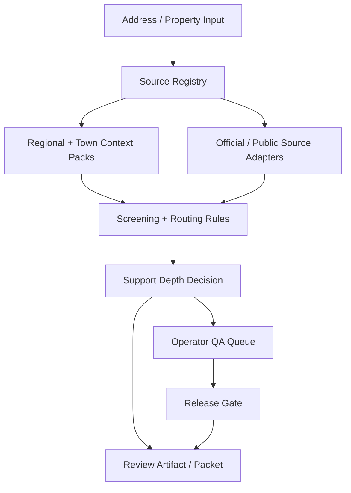

# Lasting Ground — Source-Backed Property Review System

> A full-stack, evidence-first property resilience review system.

This repository presents the product architecture, evidence model, validation posture, and sample artifact shape behind Lasting Ground. It is designed for quick technical review: what the system does, how evidence is modeled, how claims are controlled, and what the generated packet looks like.

Live demo: https://sulmusic2-star.github.io/lasting-ground-showcase/
Sample PDF packet: https://sulmusic2-star.github.io/lasting-ground-showcase/assets/lasting-ground-sample-packet.pdf
Sample packet builder: [`tools/build_sample_packet_assets.py`](tools/build_sample_packet_assets.py)

## What Lasting Ground does

Lasting Ground turns fragmented public and official property context into structured review artifacts for homeowners, buyers, and local partners.

The system is built around a simple rule:

> If the source does not support the claim, the product should not pretend certainty.

That means the product is not framed as legal, engineering, inspection, or permit advice. It is a source-backed translation layer: collect relevant public/official context, show what is known, disclose what is uncertain, and package it in a way a non-technical person can read.

## What this project demonstrates

- Full-stack product architecture across frontend, backend, reports, and operator workflows
- Evidence-first source registry design
- Deterministic rules for support depth and claim boundaries
- Region/town pack architecture for local context
- Validation gates before stronger public claims are made
- Report/packet generation thinking
- Operational QA and release-readiness practices
- Honest uncertainty handling in a regulated/real-world domain

## High-level architecture

## Core design principles

### 1. Source-backed before confident

The system distinguishes between source-backed local detail, regional/default context, missing evidence, and unsupported claims.

### 2. Deterministic where it matters

The implementation model uses explicit rules and validation gates for claim boundaries. LLM-style writing may help explain results, but it should not invent evidence.

### 3. Local context matters

A coastal town, island town, inland town, and dense city can require different source surfaces. The architecture treats local context as a first-class part of the product.

### 4. Public-facing language has to be careful

The product avoids acting like a lawyer, inspector, engineer, or permitting authority. It packages context and source links; it does not replace professional review.

## Sample artifacts

This showcase includes simplified examples:

- [`docs/system-architecture.md`](docs/system-architecture.md)
- [`docs/evidence-model.md`](docs/evidence-model.md)
- [`docs/support-depth-model.md`](docs/support-depth-model.md)
- [`sample-artifacts/sample-review-packet-outline.md`](sample-artifacts/sample-review-packet-outline.md)
- [`sample-artifacts/sample-source-register.md`](sample-artifacts/sample-source-register.md)
- [`docs/security-and-redaction.md`](docs/security-and-redaction.md)

## Repository scope

This repo focuses on the reviewable parts of the system:

- product architecture
- evidence model
- support-depth model
- validation gate examples
- sample packet artifacts
- source-register structure
- demo flow and documentation

## Why this is a serious build

Most demos stop at a UI. Lasting Ground required a deeper operating model:

- data provenance
- claim boundaries
- source durability
- region/town variance
- artifact generation
- QA and release gates
- public language safety

That is the work that makes a real product different from a mockup.

## Status

Portfolio showcase for product review and technical evaluation.
