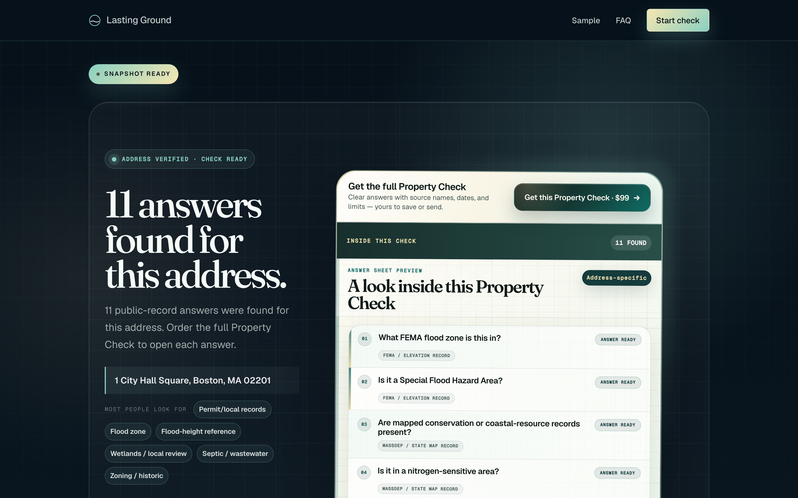
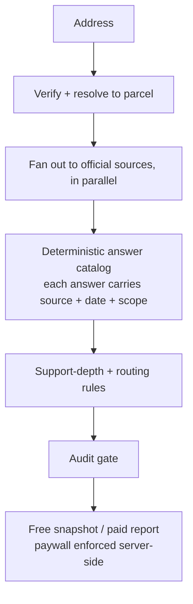

<div align="center">

# Lasting Ground

### An answer engine for public records

Type any U.S. property address. In seconds, get source-cited public-records answers, assembled live from a dozen-plus official government systems and stamped with the source and date for every line. A live, paid product I designed and operate solo.

[**lastingground.com**](https://lastingground.com) &nbsp;·&nbsp; [**Case study**](docs/case-study.md) &nbsp;·&nbsp; [**How I built it**](https://github.com/sulmusic2-star/agentic-engineering)

[](https://github.com/sulmusic2-star/lasting-ground-showcase/actions)
[](https://github.com/sulmusic2-star/lasting-ground-showcase/actions)
[](docs/coverage-summary.md)
[](https://lastingground.com)

</div>

---



> This repo is a public showcase of the engineering: runnable, tested examples of the validation and packet logic on synthetic input. The product's source-acquisition pipeline — how specific records are discovered, accessed, and normalized — is its competitive moat and is kept proprietary. Full reasoning is in the [case study](docs/case-study.md).

## What it does

Before someone buys, renovates, or lends against a property, the same questions come up: Is it in a FEMA flood zone, and what will insurance cost? Was it mapped out of the floodplain? Are there wetlands, contamination, or zoning limits?

Those answers live in dozens of disconnected government systems. Lasting Ground turns one address into a source-cited answer set in seconds, and tells you, for every line, which official source it came from and when.

## How it's built

- **~200 backend services** (Python / FastAPI) with source registries, schedulers, and nightly refresh runners.
- Each address fans out to **a dozen-plus live queries** against official federal, state, and municipal sources; every answer carries its source name and date.
- A **serverless edge front end** (Cloudflare Pages + Functions, Google Places, Stripe) over the engine, with the paywall enforced server-side.
- **Deterministic by design.** The compliance-critical answers never pass through a language model, so they stay reproducible and traceable to an official source.



**Source families:** Any U.S. address resolves with FEMA NFHL, OpenFEMA, and national layers, so the product is available in every U.S. state and Washington, DC. On top of that baseline, covered states add their own official public layers (cadastral, roads, environmental, natural-heritage, and historic layers, and the like), and local building-permit records and parcel-level zoning come in where towns publish them. *(Which municipal systems, and how they're accessed, is the proprietary part.)*

## How I built it

Solo, by orchestrating AI coding agents (Claude Code and OpenAI Codex) with review gates and verification before anything ships. The judgment is mine: architecture, what to trust, and where a model belongs versus where it doesn't. I wrote that operating model up, with runnable examples, in **[agentic-engineering](https://github.com/sulmusic2-star/agentic-engineering)**.

## Inspect the engineering

This repo runs offline on synthetic input:

```bash
python -m pip install -e ".[dev]"
make ci
python examples/source_lane_validation.py
```

**18 passing tests at 93.29% line coverage.** Start with the [case study](docs/case-study.md), then the [evaluator guide](docs/evaluator-guide.md), the [ADRs](docs/adr/README.md), and the example logic: [`evidence_scoring.py`](examples/evidence_scoring.py), [`source_lane_validation.py`](examples/source_lane_validation.py), [`packet_composer.py`](examples/packet_composer.py).

## Scope

Informational only. Not a survey, attorney opinion, engineering advice, insurance or lending advice, or a determination by any municipal board. Where the source trail points to a board, agency, or licensed professional, the product names that context without making the determination itself.

---

[**lastingground.com**](https://lastingground.com) &nbsp;·&nbsp; [hello@lastingground.com](mailto:hello@lastingground.com) &nbsp;·&nbsp; [Portfolio](https://sulmusic2-star.github.io/)
