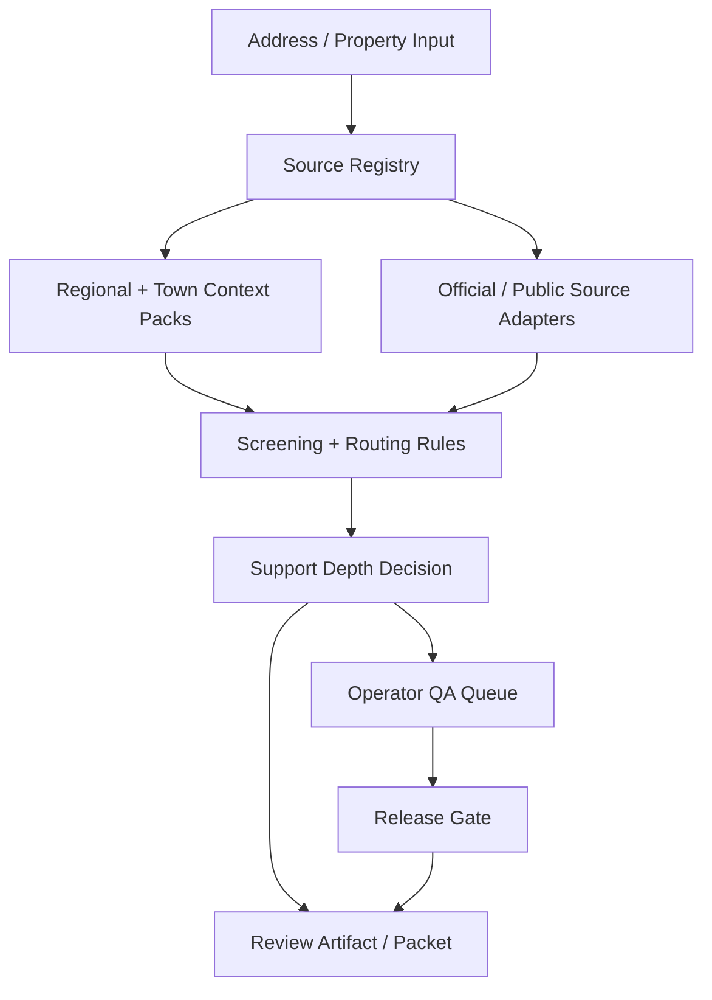

# Lasting Ground — Source-Backed Property Review System

[](https://github.com/sulmusic2-star/lasting-ground-showcase/actions/workflows/ci.yml)


> A full-stack, evidence-first system for turning fragmented property context into readable review packets.

Lasting Ground is built around a simple rule: if a source does not support a claim, the product should not pretend certainty. The system collects public/official context, organizes it into evidence lanes, applies validation gates, and generates a packet a normal person can read.

Live demo: https://sulmusic2-star.github.io/lasting-ground-showcase/  
Sample PDF packet: https://sulmusic2-star.github.io/lasting-ground-showcase/assets/lasting-ground-sample-packet.pdf  
Sample packet builder: [`tools/build_sample_packet_assets.py`](tools/build_sample_packet_assets.py)

## What it does

Lasting Ground turns fragmented property context into structured review artifacts for homeowners, buyers, and local partners.

It is not framed as legal, engineering, inspection, or permit advice. It works as a translation layer: show what the sources say, show what is still uncertain, and package the result clearly.

## What this build shows

- Full-stack product architecture across frontend, backend, reports, and operator workflows
- Evidence-first source registry design
- Rules for support depth and claim strength
- Region/town pack architecture for local context
- Validation gates before stronger claims are shown
- Report/packet generation workflows
- QA and release-gate thinking
- Clear uncertainty handling in a real-world domain

## High-level architecture



## Core design principles

### Source-backed before confident

The system separates source-backed local detail, regional/default context, missing evidence, and unsupported claims.

### Deterministic where it matters

Rules and validation gates decide what can be said before any generated explanation appears.

### Local context matters

A coastal town, island town, inland town, and dense city can require different source surfaces. The architecture treats local context as part of the product, not a footnote.

### Careful language is part of the system

The packet explains context and source direction without acting like a lawyer, inspector, engineer, or permitting authority.


## Code examples

Small examples show how sample source-lane input becomes a validation output before packet generation:

- [`examples/sample_packet_input.json`](examples/sample_packet_input.json)
- [`examples/source_lane_validation.py`](examples/source_lane_validation.py)
- [`examples/sample_validation_output.json`](examples/sample_validation_output.json)
- [`examples/packet_language.py`](examples/packet_language.py)
- [`examples/evidence_scoring.py`](examples/evidence_scoring.py)
- [`examples/packet_composer.py`](examples/packet_composer.py)
- [`examples/sample_packet_summary.txt`](examples/sample_packet_summary.txt)
- [`docs/coverage-summary.md`](docs/coverage-summary.md)

## Run the code examples

```bash
python -m pip install -e ".[dev]"
make ci
python examples/source_lane_validation.py
```

The tests verify lane warnings, support-depth decisions, rejected statuses, evidence scoring, packet readiness, cautious packet language, generated outputs against committed samples, and coverage for the public validation examples.

## Sample artifacts

- [`docs/system-architecture.md`](docs/system-architecture.md)
- [`docs/engineering-decisions.md`](docs/engineering-decisions.md)
- [`docs/testing.md`](docs/testing.md)
- [`docs/evidence-model.md`](docs/evidence-model.md)
- [`docs/support-depth-model.md`](docs/support-depth-model.md)
- [`sample-artifacts/sample-review-packet-outline.md`](sample-artifacts/sample-review-packet-outline.md)
- [`sample-artifacts/sample-source-register.md`](sample-artifacts/sample-source-register.md)
- [`sample-artifacts/sample-validation-gate.md`](sample-artifacts/sample-validation-gate.md)

## Why this is a serious build

Most demos stop at a UI. Lasting Ground required the operating layer behind the UI:

- data provenance
- source durability
- support-depth rules
- region/town variance
- generated artifacts
- QA and release gates
- careful public language

That is the work that makes a product system different from a mockup.
