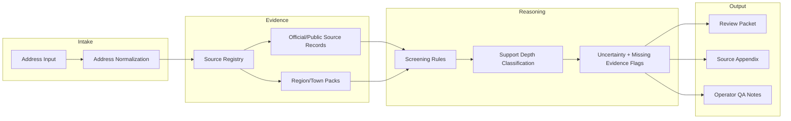

# System Architecture

Lasting Ground is organized around a source-backed review workflow.

## Layers

### Frontend

Public-facing intake and explanation surfaces. The frontend should make the product understandable without overpromising certainty.

### Backend

API services for address handling, screening, report generation, source registry access, and operational dashboards.

### Packs

Reusable regional and town-specific context packs. Packs separate local source coverage from generic defaults.

### Validation

Release gates and support-depth checks prevent the product from overstating what the source set can actually prove.

## Shareable abstraction

The key architectural lesson is to separate evidence collection, deterministic routing, claim boundaries, and user-facing explanation.
